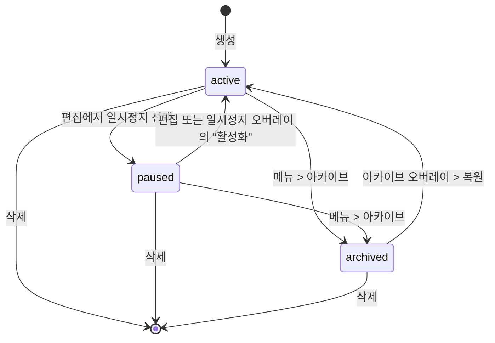
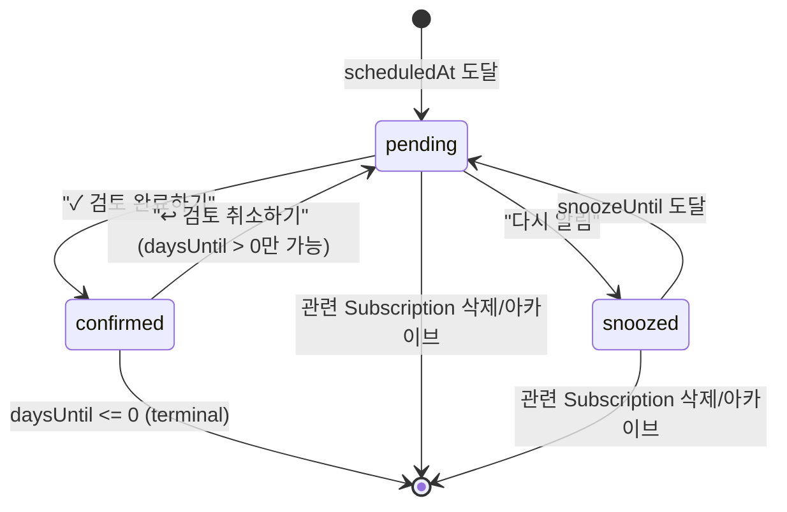
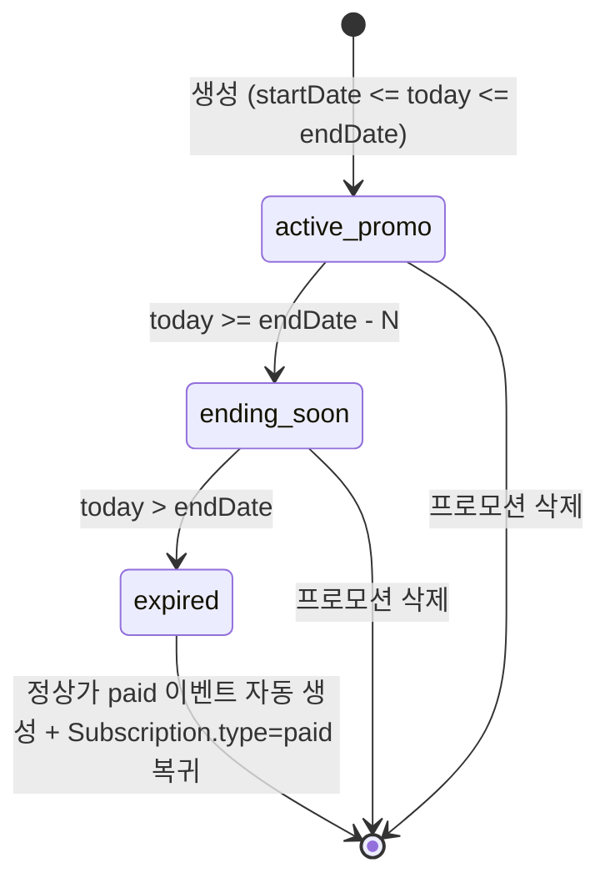

# 개인 구독 관리 앱 요구사항 명세서

## 1. 개요

### 1.1 제품 목적

본 앱은 **개인 사용자가 자신이 가입한 SaaS / 미디어 / 디지털 구독 서비스(Netflix, Spotify, 쿠팡와우, Apple One, iCloud, Adobe Creative, Notion 등)를 한 곳에서 트래킹**하도록 돕는 개인용 구독 관리 도구이다. 여러 서비스에 산발적으로 지출되는 구독 비용을 가시화하고, 결제일을 놓치지 않도록 알림을 제공하며, 지출 패턴을 통계로 보여주어 "구독 피로(subscription fatigue)"와 불필요한 지출을 줄이는 것이 핵심 가치이다.

B2B 라이선스 관리, 팀 시트 배정, SSO, SCIM 같은 기업용 구독 관리 기능은 **범위 밖**이다. 모든 데이터는 "나의 것"이며, 다른 사용자와 공유하지 않는다.

### 1.2 대상 유저

- 매월 3~10개 이상의 유료 구독에 가입해 지출 관리가 어려운 개인 사용자
- 체험판(Trial) 종료일·프로모션 종료 후 정상가 전환 시점을 자주 놓치는 사용자
- KRW 외에도 USD 등 외화로 결제되는 구독(Apple One, Spotify Duo 등)을 병행하는 사용자
- 개인 데이터 민감도를 고려해 **로그인 없이도** 기기 로컬에서 시작하고 싶은 사용자 (프로토타입 L666, L1285-1296에 "로그인하지 않음 / 로그인 없이 사용" 경로 명시)

### 1.3 MVP 범위 vs 프로토타입 최종 목표

프로토타입(`subscription_detail_prototype.html`, 총 1908줄)에는 최종 비전에 해당하는 기능까지 포함되어 있다. 반면 루트 `README.md`의 "MVP 기능 요구사항"(L183-219)은 **훨씬 축소된 초기 버전**을 기술한다. 본 명세서는 두 문서를 모두 근거로 하여 MVP / Phase 2 / Backlog의 3단계로 구분한다. "프로토타입에는 구현되었으나 README MVP에는 없는" 기능(예: 4종 구독 유형, 일시정지, 알림 스누즈, 프로모션, 결제 이력 타임라인)은 모두 Phase 2 이상으로 분류한다. 상세는 §7 참조.

**MVP의 한 줄 정의**: "로컬에서 동작하는, CRUD + 1일전/당일 알림 + 기본 통계를 갖춘 PWA".

**최종 비전의 한 줄 정의**: "프로모션·체험판까지 추적하는 결제 이력 타임라인, 확장 가능한 알림 엔진(스누즈/커스텀 오프셋/검토 상태), 풀 통계 대시보드(월별 추이·유형별 구성·Top 5), 위젯·Google 동기화를 제공하는 개인 구독 트래커".

---

## 2. 용어

| 용어          | 영문 / 필드 키       | 정의                                                                                                                                         |
| ------------- | -------------------- | -------------------------------------------------------------------------------------------------------------------------------------------- |
| 구독          | Subscription         | 사용자가 트래킹하는 하나의 서비스(Netflix, Spotify 등) 단위. 프로토타입 L1631-1638의 `SUBS` 배열의 엔트리 1건에 해당.                        |
| 구독 유형     | type                 | `paid`(유료) / `free`(무료) / `trial`(체험판) / `promo`(프로모션) 4종. L962-970, L1059-1063.                                                 |
| 구독 상태     | status               | `active`(활성) / `paused`(일시정지) / `archived`(아카이브) 3종. L880-886(편집 모드의 상태 버튼), L1637(paused 예시), L620-635(archive 복원). |
| 결제 이벤트   | PaymentEvent         | 결제 내역 타임라인의 노드 1건. `paid`/`free`/`trial`/`promo`/`change` 5종. L1067-1074, L772-777.                                             |
| 알림 규칙     | NotificationRule     | "결제일 기준 N일 전 오전 9시" 같이 **언제** 알림을 발사할지 정의하는 설정. 프리셋 5종 + 커스텀(day/week 단위). L1380-1386.                   |
| 알림 인스턴스 | NotificationInstance | 특정 결제일에 대해 실제로 생성된 알림 1건. 상태 머신을 갖는다. L1455-1462의 `ALERTS`.                                                        |
| 프로모션      | Promotion            | 일정 기간 동안 할인가가 적용되는 서브 정보. `discount_type` + `amount`/`percent` + `startDate`/`endDate`. L971-1001.                         |
| 결제 주기     | cycle                | 매주 / 매월 / 매년 / 커스텀(N일·N주·N개월). L912-917, L944-948.                                                                              |
| 다음 결제일   | nextPaymentDate      | 주기 기반으로 계산되는 "다음 번 돈이 빠져나갈 날짜". 프로토타입에서는 `NP=2026-04-12`로 고정(L1375).                                         |
| 며칠 남음     | daysUntil            | 오늘로부터 다음 결제일까지의 일수. 음수 가능(확인됨/과거). L1456, L1709-1714.                                                                |
| 디데이(D-n)   | dDay                 | "며칠 남음"의 한글/영문 레이블(`오늘`/`내일`/`D-n`). L1709-1714, L1482-1484.                                                                 |
| 검토 완료     | confirmed            | 결제 알림을 사용자가 "이번 결제 인지했다"로 표시하는 액션. L1515 `doConf()`.                                                                 |
| 스누즈        | snooze               | 알림을 일시적으로 연기. L1498-1510, L1529.                                                                                                   |

---

## 3. 데이터 모델

### 3.1 User

로그인 없이도 앱 전체가 동작해야 한다(L666, L1291-1292 "백업·동기화 불가"). 따라서 `User`는 **옵셔널 엔티티**이며, 존재하지 않을 때는 모든 데이터가 로컬 DB(예: IndexedDB)에 귀속된다.

| 필드         | 타입     | 제약             | 설명                                       |
| ------------ | -------- | ---------------- | ------------------------------------------ |
| id           | UUID     | PK               | 서버 사용자 식별자                         |
| email        | string   | unique, nullable | Google OAuth에서 받은 이메일               |
| name         | string   | nullable         | 표시 이름                                  |
| provider     | enum     | `google`         | L1278 "Google로 로그인"만 지원. Apple 없음 |
| providerSub  | string   | unique           | OAuth subject                              |
| createdAt    | datetime |                  |                                            |
| lastSyncedAt | datetime | nullable         | 마지막 동기화 시각                         |

> **로컬 전용 모드**: User가 없으면 모든 Subscription·PaymentEvent·NotificationRule은 `userId=null`로 저장되며, 로그인 시 기기 로컬 데이터를 서버로 업로드하는 초기 동기화 플로우가 필요하다(열린 이슈 §8-5 참조).

### 3.2 AppSetting

단일 레코드(싱글톤). 사용자별로 1개 존재.

| 필드             | 타입                            | 기본값 | 근거             |
| ---------------- | ------------------------------- | ------ | ---------------- |
| language         | enum                            | `ko`   | L672 "한국어"    |
| defaultCurrency  | enum                            | `KRW`  | L673 "₩ 원"      |
| firstScreen      | enum(`stats`\|`subs`\|`alerts`) | `subs` | L674 "구독 목록" |
| widgetShowName   | boolean                         | true   | L1229 on         |
| widgetShowDDay   | boolean                         | true   | L1230 on         |
| widgetShowAmount | boolean                         | true   | L1231 on         |

### 3.3 NotificationSetting

| 필드                 | 타입               | 기본값                          | 근거                                                               |
| -------------------- | ------------------ | ------------------------------- | ------------------------------------------------------------------ |
| applyDefaultOnCreate | boolean            | false                           | L1178 "알림 기본 적용" 토글 (`off` 상태로 초기화)                  |
| defaultTime          | time (HH:mm)       | `09:00`                         | L1193 select의 첫 옵션                                             |
| defaultRules         | NotificationRule[] | `[{오프셋:1일 전, 시간:09:00}]` | L1843-1844 `DEFAULT_NOTIF={label:'결제 하루 전', sub:'오전 9:00'}` |

`applyDefaultOnCreate=true`이면 새 Subscription 생성 시 `defaultRules`가 해당 구독의 NotificationRule로 복사된다(L1175 "켜면 새 구독 항목에 아래 알림이 자동 추가됩니다").

### 3.4 Subscription

| 필드               | 타입                                | 제약               | 설명·근거                                                     |
| ------------------ | ----------------------------------- | ------------------ | ------------------------------------------------------------- |
| id                 | string (UUID 또는 `s1`식)           | PK                 | L1632 `id:'s1'`                                               |
| userId             | UUID?                               | FK, nullable       | 로컬 모드 대응                                                |
| name               | string                              | required, max 80   | L872 `ename-input`                                            |
| icon               | string(emoji)                       | required, max 4    | L1553 `EMOJIS` 18종 + 사용자 직접 입력(L1028 `maxlength="2"`) |
| colorPreset        | enum(`c0`..`c5`)                    | required           | L1554-1561 6종 그라디언트                                     |
| amount             | integer                             | ≥ 0                | L896 `type="number"`                                          |
| currency           | enum(`KRW`/`USD`/`EUR`/`JPY`)       | L901-906           |                                                               |
| cycle              | object                              | required           | 아래 Cycle 구조                                               |
| nextPaymentDate    | date                                | required           | L922                                                          |
| paymentMethod      | enum+string                         |                    | L927-932: 카드 말미 4자리(`card1`), `paypal`, `other`         |
| paymentMethodLabel | string                              | nullable           | "•••• 1234" 표시용 마스킹                                     |
| type               | enum(`paid`/`free`/`trial`/`promo`) | default `paid`     | L963-969                                                      |
| status             | enum(`active`/`paused`/`archived`)  | default `active`   | L881-886                                                      |
| memo               | text                                | nullable, max 2000 | L813, L1010                                                   |
| sortOrder          | integer                             |                    | L1639 `hSubsOrder`, L1744-1748 드래그로 재정렬                |
| archivedAt         | datetime                            | nullable           | 아카이브 시각 (L623 "2024년 12월 해지" 표시용)                |
| createdAt          | datetime                            |                    |                                                               |
| updatedAt          | datetime                            |                    |                                                               |

#### Cycle 구조 (embedded)

```
{
  kind: 'weekly' | 'monthly' | 'yearly' | 'custom',
  customN: integer,            // kind='custom'일 때만 유효
  customUnit: 'day'|'week'|'month'  // kind='custom'일 때만 유효
}
```

- `kind` 후보 L913-917의 select option 4개와 1:1 매핑.
- `customUnit`은 L945-948의 `day/week/month` 3종. **알림 커스텀의 `day/week` 2종과 비대칭임**(§8 열린 이슈 참조).

### 3.5 Promotion

프로모션은 **Subscription의 서브 리소스**로 모델링한다. 근거:

1. 프로토타입 L971-1001에서 편집 모드의 "구독 유형 > 프로모션" 버튼을 누르면 같은 구독 폼 안에 **인라인으로 프로모션 상세 필드가 확장**된다(별도 엔티티 편집 경로가 없음).
2. 프로모션 종료 이후 "정상 금액으로 새 결제 항목을 추가하면 타임라인에서 프로모션 → 정상가 전환 이력이 이어집니다"(L1000)라는 설명은, 프로모션이 Subscription의 생명 주기 한 구간이라는 관점을 시사한다.
3. 한편 타임라인상으로는 프로모션 구간이 `promo` 타입의 **PaymentEvent 1건**으로도 기록된다(L777, L1074). 따라서 구현상 Subscription에 `currentPromotion` 필드를 두되, 타임라인 렌더링용으로는 PaymentEvent도 별도 생성한다.

| 필드           | 타입                            | 제약                                       | 설명·근거 |
| -------------- | ------------------------------- | ------------------------------------------ | --------- |
| id             | UUID                            | PK                                         |           |
| subscriptionId | UUID                            | FK → Subscription                          |           |
| discountType   | enum(`free`/`amount`/`percent`) | required                                   | L977-981  |
| amount         | integer                         | `discountType`이 `free`/`amount`일 때 유효 | L984-987  |
| percent        | integer (0-100)                 | `discountType=percent`일 때 필수           | L988-990  |
| startDate      | date                            | required                                   | L993-995  |
| endDate        | date                            | required                                   | L996-998  |

### 3.6 PaymentEvent

**결제 이력 타임라인의 노드**. 유형별 페이로드가 다르다(L1067-1074, L772-777).

| 필드             | 타입                                         | 설명                                                                          |
| ---------------- | -------------------------------------------- | ----------------------------------------------------------------------------- |
| id               | UUID                                         | PK                                                                            |
| subscriptionId   | UUID                                         | FK                                                                            |
| eventType        | enum(`paid`/`free`/`trial`/`promo`/`change`) | L75-78의 dot 색상 + L256 `.td.promo`로 5종 확인                               |
| occurredAt       | date                                         | `change`/`paid`는 단일 날짜, `free`/`trial`/`promo`는 기간(아래 endedAt 사용) |
| endedAt          | date?                                        | `free`/`trial`/`promo`만 사용 (L775 "2025년 6월 12일 ~ 10월 12일")            |
| amount           | integer                                      | `paid`/`promo`는 실 결제액, `free`/`trial`은 0, `change`는 변경 후 금액       |
| currency         | enum                                         | Subscription과 동일하지만 과거 변경 추적을 위해 snapshot                      |
| label            | string                                       | "Spotify Premium", "요금제 변경", "프로모션 적용" 등(L773, L777)              |
| changeFromAmount | integer?                                     | `eventType=change` 전용 — L773 "₩10,900 → ₩13,900"                            |
| changeFromPlan   | string?                                      | `eventType=change` 전용 — L773 "Individual→Duo"                               |
| promoDetail      | string?                                      | `promo` 전용 — L777 "50% 할인 (3개월)"                                        |
| trialDuration    | string?                                      | `trial` 전용 — L776 "체험판 (3개월)"                                          |
| freeReason       | string?                                      | `free` 전용 — L775 "무료 (가족)"                                              |
| createdAt        | datetime                                     |                                                                               |

타입별 시각 스타일: `paid`=녹색 dot, `change`=주황 dot + 하이라이트 카드, `free`=보라, `trial`=하늘, `promo`=핑크.

### 3.7 NotificationRule

특정 구독에 대해 "언제 알림을 울릴지"를 정의.

| 필드           | 타입                              | 설명·근거                                                                                               |
| -------------- | --------------------------------- | ------------------------------------------------------------------------------------------------------- |
| id             | UUID                              |                                                                                                         |
| subscriptionId | UUID?                             | null이면 `NotificationSetting.defaultRules`의 전역 기본 규칙                                            |
| presetKey      | enum(`same`/`d1`/`d2`/`d3`/`w1`)? | L1381-1385. 커스텀이면 null                                                                             |
| offsetN        | integer                           | `presetKey`의 days(0/1/2/3/7) 또는 커스텀 N                                                             |
| offsetUnit     | enum(`day`/`week`)                | L832: `<option value="day">날</option> <option value="week">주</option>` — 커스텀 UI는 month가 **없음** |
| time           | string (HH:mm)                    | 기본 `09:00` (L1381-1385의 `time:'오전 9:00'`)                                                          |
| createdAt      | datetime                          |                                                                                                         |

PRESET 매핑:

- `same` = 0일 전(= 당일, "결제 당일")
- `d1` = 1일 전("하루 일찍")
- `d2` = 2일 전
- `d3` = 3일 전
- `w1` = 7일 전("일주일 일찍")

### 3.8 NotificationInstance

실제 발사되거나 예정된 개별 알림 1건. `NotificationRule × nextPaymentDate` 조합으로 생성.

| 필드              | 타입                                  | 설명·근거                                                  |
| ----------------- | ------------------------------------- | ---------------------------------------------------------- |
| id                | UUID                                  | L1456 `id:'a1'`                                            |
| ruleId            | UUID                                  | FK                                                         |
| subscriptionId    | UUID                                  | FK (denormalized)                                          |
| scheduledAt       | datetime                              | 규칙으로 계산된 발사 예정 시각                             |
| status            | enum(`pending`/`snoozed`/`confirmed`) | L1456 `status:'pending'`; L1529 snoozed; L1538 confirmed   |
| snoozeLabel       | string?                               | 스누즈 프리셋 레이블 또는 커스텀(예: `2일`) — L1476, L1529 |
| snoozeUntil       | datetime?                             | 스누즈로 미뤄진 새 발사 시각                               |
| confirmedAt       | datetime?                             | L1460 `ca:'오늘 오전 9:03'`, L1538                         |
| urgent            | boolean                               | `daysUntil<=1` 캐시 플래그 (L1456)                         |
| isPromoTransition | boolean                               | L1458 `isPromo:true` — 프로모션 → 정상가 전환 알림 여부    |
| promoMessage      | string?                               | L1458 "프로모션 종료 · 정상가로 전환 예정"                 |

---

## 4. 화면 명세

프로토타입의 `.phone` 블록을 번호순으로 기술한다. 각 화면은 실제 구현에서 라우팅상 별도 페이지 또는 오버레이로 구현된다.

### Phone 0 — 메인 (통계 | 구독 | 알림 스와이프)

**목적**: 3개 탭(통계/구독/알림)을 좌우 스와이프로 전환하는 홈. 기본 탭은 "구독"(L1905 `goTab(1)`).

**UI 구성**:

- 상태바, 좌우 스와이프 트랙(L446-601)
- 패널 0 = 통계(L449-527): 기간 선택(이번 달/3개월/올해 L453-456), KPI 4카드(이번 달 지출, 연간 예상, 활성 구독 수, 평균 구독 비용 L460-481), 월별 지출 추이 바차트(L484-494), 유형별 구성(L497-504), 서비스별 Top 5(L508-514), 월별 상세(L518-525)
- 패널 1 = 구독 목록(L530-587): 상단 헤더(인사말+타이틀 L533-534), 우측 상단 아카이브·설정 버튼(L537-542), 요약 바(이번 달 결제 / 활성 구독 / 미확인 알림 L546-551), 필터 행(L552-566: 정렬 드롭다운 — 결제 예정일순/이름순/금액순), 구독 카드 리스트(L567 `#subsList`, L1716-1728 `makeCard`), 하단 일시정지 접근 버튼(L569-585), FAB(L605)
- 패널 2 = 알림 센터(L590-599): 상단 필터(전체/미확인/확인됨 L593-595), 카드 목록(L597 `#ncc`)
- 하단 탭바 3탭 + 탭 인디케이터(L702-717)
- 오버레이 페이지: 아카이브(L608-638), 일시정지(L641-653), 설정(L656-699)

**액션·상태 전환**:

- 스와이프/탭 → `goTab(idx)` (L1791)
- 구독 카드 탭 → Phone 1(상세)
- 구독 카드 드래그 → `sortOrder` 변경, 정렬 모드는 `manual`로 자동 변경(L1748)
- FAB(+) → 새 구독 추가(Phone 3의 "새로 만들기" 변형)
- 우측상단 아카이브 버튼 → 아카이브 오버레이 슬라이드인
- 우측상단 설정 버튼 → 설정 오버레이 슬라이드인
- 일시정지 버튼 → 일시정지 오버레이 슬라이드인 (L1680)
- 아카이브 오버레이의 "복원" 버튼 → 해당 구독을 `active`로 복구(L625)
- 일시정지 오버레이의 "활성화" 버튼 → `paused` → `active`(L1704)

### Phone 1 — 구독 상세

**목적**: 단일 구독의 모든 정보(결제액, 주기, 결제 이력, 알림, 메모) 조회 및 빠른 토글.

**UI 구성** (L723-841):

- 상단 뒤로가기 + 서비스명 + "⋮" 메뉴 (L730-736, 드롭다운은 편집·복제·아카이브·삭제)
- 서비스 헤더(아이콘 + 이름 + 상태/유형 뱃지 L738-742)
- Hero 카드(L743-756): 이번 달 결제금액 강조, 우측에 Ring chart(30일 정규화, L47 `stroke-dasharray:163`, L1451 `c-(18/30)*c`)와 "N일 남음", 하단에 "다음 결제일 / 날짜(요일)"
- 서비스 통계 3칸(총 결제금액 / 결제 횟수 / 이용 기간 L757-761)
- 결제 내역 섹션(L762-784): 필터 탭(전체/유료/무료/체험판/프로모션 L764-770), 타임라인(L771-778), 전체 내역 보기 버튼(L779-783) → Phone 4
- 상세 정보 카드(L785-793): 결제금액·주기·다음 결제일·결제 수단
- 알림 설정 카드(L794-810): 결제 알림 토글, 알림 리스트, "알림 추가" 액션(L804-807 → 바텀시트)
- 메모(L811-814)
- 바텀시트 `bs1`(L818-840): 알림 추가 — 프리셋 라디오 목록 + "사용자 설정" 아코디언(단위 day/week, 앞당기는 수, 고정 시간 09:00)

**액션**:

- `toggleMain1` (L1388): 알림 마스터 토글 off ↔ on. on일 때만 알림 리스트 영역이 펼쳐짐.
- `openSheet1`/`ca1`: 알림 추가(프리셋 또는 커스텀). `added1`(L1387)로 이미 추가된 프리셋은 재선택 불가.
- `ft`(L1434): 필터 탭. `initTl1Tabs`(L1441)로 **해당 유형의 이벤트가 0건이면 탭 자체를 숨김**.
- `em1`: 메모 inline edit.
- "⋮" 메뉴: 편집(→ Phone 3), 복제, 아카이브, 삭제(L732-734).

### Phone 3 — 편집 모드

**목적**: 구독 생성·수정 통합 폼.

**UI 구성** (L847-1036):

- 상단 취소/편집/수정완료 버튼(L852-856)
- 편집 배너(L859-862)
- 아이콘 영역(L865-874): 아이콘 탭 → 이모지 + 색상 팝업(L1021-1035)
- 이름 입력(L871-873)
- 상태 선택(L877-888): 활성 / 일시정지 (아카이브·삭제는 별도 경로로만 전환)
- 결제 정보 카드(L891-935): 금액, 통화, 주기(select), 다음 결제일, 결제 수단
- 커스텀 주기 확장 블록(L937-955): 주기가 `custom`일 때 펼쳐짐. `매 N (일/주/개월) 마다` 형태
- 구독 유형 버튼 4종(L961-970). 프로모션 선택 시 프로모션 폼 확장(L971-1002)
- 메모(L1007-1012)
- 수정완료 버튼(L1014-1017)

**액션**:

- `onCycleChange` (L1596): `custom` 선택 시 블록 확장, 미리보기 업데이트.
- `updateCyclePreview` (L1603): "N일/주/개월마다" 프리뷰 갱신.
- `selType` (L1609): 유형 토글. `프로모션` 시 `promoForm.open` 클래스 추가로 폼 확장.
- `onPromoTypeChange` (L1616): free/amount/percent 선택에 따라 금액/% row 토글.
- `selStatus` (L1621): 활성/일시정지 토글.
- `openIconMenu`/`applyIcon` (L1564, L1579): 이모지 입력 + 6색 그라디언트 중 선택.
- `saveEdit` (L1592): 폼 저장. 삭제 버튼은 취소 버튼과 별도(L227).

### Phone 4 — 전체 결제 내역

**목적**: 한 구독의 전체 PaymentEvent를 무제한 조회 및 수정.

**UI 구성** (L1041-1113):

- 상단 뒤로가기 + "결제 내역" 타이틀
- 서비스 미니 헤더(아이콘+이름, 총 건수+누적액 L1050-1056)
- 필터 탭 5종(L1058-1064)
- 타임라인(L1066-1076): 각 항목은 클릭 가능(L1067 `onclick="openEditSheet(...)"`)
- 내역 수정 바텀시트(L1081-1112): 항목명/금액/날짜/유형 + "변경 이력 노드를 삭제하면 전후 연결이 끊어집니다" 경고(L1104-1106)

**액션**:

- `fth` (L1544): 필터 전환
- `openEditSheet`/`saveEditSheet` (L1758, L1772): 개별 PaymentEvent 편집

### Phone 5 — 설정

**목적**: 앱 전역 설정.

**UI 구성** (L1118-1301):

- 계정 프로필 카드(L1128-1135): "로그인하지 않음 / 로그인하면 백업·동기화가 활성화됩니다". 탭하면 계정 바텀시트.
- 일반 그룹(L1138-1163): 언어, 기본 통화, 첫 화면
- 새 구독 추가 시 기본 알림(L1166-1205): 전역 토글 → on 시 알림 규칙 리스트 편집 + 알림 기본 시간 select(09:00/08:00/10:00/18:00) + 알림 추가
- 위젯(L1207-1237): 미리보기 카드 + 3개 토글 칩(항목명/디데이/금액)
- 법적 고지(L1239-1258): 개인정보처리방침, 이용약관
- 로그아웃 버튼(L1260-1263)
- 버전 라벨(L1264 "v0.1.0 MVP")
- 계정 바텀시트(L1270-1300): "Google로 로그인" + "로그인 없이 사용" 2옵션

**액션**:

- `toggleGlobalNotif` (L1846): 전역 알림 기본 적용 on/off. on으로 켤 때 리스트가 비어있으면 `DEFAULT_NOTIF` 자동 복원.
- `openSetNotifSheet` (L1855): 알림 프리셋 입력(prompt 기반의 임시 UI)
- `removeSetNotif` (L1862): 항목 제거. 마지막 항목 삭제 시 **기본 항목 자동 복원**(L1864-1867).
- `toggleWp` (L1888): 위젯 필드 토글 → 실시간 미리보기 반영.

### Phone 6 — 통계 (준비 중)

**목적**: MVP에서는 통계가 축소 상태임을 명시하는 "Coming Soon" 화면.

**UI 구성** (L1306-1353): "준비 중" 배지, 이번 달/연간 예상 요약 카드 2개, 서비스별 지출 프리뷰 바 차트(흐림 처리 0.4), 안내 배너("통계 기능은 다음 업데이트에서...").

**포지션**: 실제 출시 타임라인에서 Phone 6은 **MVP 단계의 통계 대체 화면**이고, Phone 0의 패널 0(풀 통계)는 Phase 2+에서 교체된다.

### Phone 7 — 아카이브 오버레이

**목적**: 더 이상 사용하지 않는 구독 항목 조회 + 복원.

**UI 구성** (L608-638): "더 이상 사용하지 않는 구독 항목입니다" 안내 + 각 카드에 해지 시점 + "복원" 버튼.

**액션**: "복원" 탭 시 해당 Subscription의 `status`를 `active`로 변경(혹은 `paused` 복원 선택 — 열린 이슈 §8-8).

### Phone 8 — 일시정지 오버레이

**목적**: 결제가 중단된 구독 모음 + 재활성화.

**UI 구성** (L641-653, 렌더는 L1690-1706): 카드 목록. 각 카드에 "다음 결제 예정 · 날짜" + "활성화" 버튼.

**액션**: "활성화" 탭 → `paused` → `active`.

---

## 5. 기능 상세

### 5.1 결제 주기 계산

**기본 규칙**:

- `weekly`: nextPaymentDate = 현재 결제일 + 7일
- `monthly`: nextPaymentDate = 현재 결제일 + 1개월
- `yearly`: nextPaymentDate = 현재 결제일 + 1년
- `custom`: nextPaymentDate = 현재 결제일 + (customN × customUnit)

**월말 edge case** (열린 이슈 §8-3):

- 1월 31일 결제 → 다음 결제일 계산 시 2월에는 28/29일만 존재. 권장 규칙: "해당 월의 마지막 존재하는 날(clamp)"을 채택. 예: 2026-01-31 monthly → 2026-02-28, 2026-03-31, 2026-04-30.
- 이 규칙은 향후 2026-05-30으로 진행하는가 2026-05-31로 복귀하는가의 "앵커 드리프트" 이슈를 동반. 앵커 드리프트 대신 **원본 일자 유지(anchor day)**를 유지하기로 결정(§8-3).

**커스텀 주기**:

- UI는 "매 N (일/주/개월)마다"(L941-951)
- 최소 1, 최대 365(L942)
- 미리보기는 즉시 반영: "N(일/주/개월)마다 · 다음 결제일 기준 반복"(L1607)

### 5.2 며칠 남음 표시

`daysLabel(d)` (L1709-1714)는 다음 분기 규칙을 따른다:

| 조건      | text   | class  | 색상                        |
| --------- | ------ | ------ | --------------------------- |
| d === 0   | `오늘` | urgent | L301 #8b7fff                |
| d === 1   | `내일` | urgent | L301 #8b7fff                |
| 1 < d ≤ 7 | `D-n`  | soon   | L300 #9b8fff                |
| d > 7     | `D-n`  | normal | L302 rgba(255,255,255,0.45) |

알림 센터에서는 "내일"/"D-n" 칩 렌더링이 별도로 있음 — L1482-1484.

### 5.3 알림 트리거

#### 프리셋 (5종, L1380-1386)

규칙 생성 시 `presetKey`만 저장. 실제 발사 시각 계산은 클라이언트:

```
fireAt = subscription.nextPaymentDate
         - offsetDays (same=0, d1=1, d2=2, d3=3, w1=7)
         + time (NotificationSetting.defaultTime 또는 09:00)
```

#### 커스텀 (L832, L944-948에 대한 비대칭)

- **편집 모드의 주기 커스텀**은 day/week/month 3단위 (L945-948).
- **알림 추가 시트의 커스텀**은 day/week 2단위 (L832). `month`는 UI에서 선택 불가.
- 계산: `offsetDays = (offsetUnit='week' ? N*7 : N)` (L1423)
- 범위: 1 ≤ N ≤ 90 (L833)

### 5.4 스누즈 로직

알림 카드(pending)에서 "다시 알림" 버튼 탭 → 스누즈 패널 확장(L1514, L1527).

**프리셋 스누즈** (L1499-1502): `1시간 후`, `3시간 후`, `내일 아침`, `다음 주` 4종.
**커스텀 스누즈** (L1505-1510): N + 단위(시간/일/주) 선택 → `applyCustomS`(L1530).

스누즈 적용 효과:

- `status` = `snoozed`
- `snoozeLabel` = 선택된 라벨 (예: "1시간 후", "2시간", "3일")
- `snoozeUntil` = 현재시각 + 오프셋 (계산은 구현 시 확장 필요 — L1529는 라벨만 저장)
- 재발사 시점에 `pending`으로 자동 복귀

"내일 아침"의 구체적 정의(몇 시?)는 열린 이슈 §8-4.

### 5.5 검토 완료(confirmed)

"✓ 검토 완료하기"(L1515) → `status` = `confirmed`, `confirmedAt` = 현재시각.

- 확인됨 상태에서도 `daysUntil > 0`이면 "↩ 검토 취소하기" 버튼 노출(L1493) → pending 복귀.
- `daysUntil ≤ 0`(이미 지난 날짜)이면 취소 버튼이 숨겨지고 terminal 상태(L1492).

### 5.6 프로모션 생명주기 및 정상가 전환 이벤트

1. 사용자가 `type=promo` + `startDate`/`endDate` 지정 → Promotion 저장.
2. 유효 기간 중 `endDate - N일` 시점에 `isPromoTransition=true` 알림 인스턴스 생성. L1458-1459의 예시: "₩6,950 → ₩13,900 · 프로모션 종료 · 정상가로 전환 예정".
3. `endDate` 이후 새 결제일 도래 시 자동으로 정상가 금액으로 `paid` 타입 PaymentEvent 생성, Subscription.type은 `paid`로 복귀.
4. 타임라인에는 프로모션 `promo` 이벤트와 그 직후의 정상가 `paid` 이벤트가 연쇄 표시(L1000의 설명).

### 5.7 통계 계산식

| 지표            | 계산식                                                    | 근거                        |
| --------------- | --------------------------------------------------------- | --------------------------- |
| 이번 달 지출    | `Σ paidAmount(PaymentEvent)` where `occurredAt ∈ 이번 달` | L463 `₩72,200`              |
| 연간 예상       | `Σ (amount × 12/cycleInMonths)` over active subscriptions | L468 `₩866K`                |
| 활성 구독 수    | `count(Subscription where status='active')`               | L472 `5개`                  |
| 평균 구독 비용  | `이번 달 지출 / 활성 구독 수`                             | L478 `₩14,440`              |
| 월별 지출 추이  | 월별 `Σ paidAmount` 지난 6개월                            | L487-493                    |
| 유형별 구성     | `{paid, promo, paused, ...}` 유형별 금액 합 + 건수        | L497-504 (정지도 유형 취급) |
| 서비스별 Top 5  | 이번 달 PaymentEvent 금액 내림차순 상위 5건               | L509-513                    |
| 이번 달 비율(%) | `serviceAmount / monthTotal * 100`                        | L509 "37.3%"                |

### 5.8 수동 정렬 (drag-and-drop)

- 구독 카드는 `draggable="true"`로 마킹(L1719).
- 드래그 시작(L1737) → 대상 카드 강조 → drop 시 `hSubsOrder` 배열 재배치(L1744-1746).
- 정렬이 수동 재배치되면 정렬 모드가 `manual`로 변경되고 드롭다운 라벨도 "직접 정렬"로 바뀜(L1748).
- 서버 저장 시 `Subscription.sortOrder`에 영속.
- **일시정지(paused)/아카이브(archived) 항목은 드래그 대상이 아님**. 메인 리스트는 active만(L1733).

### 5.9 아이콘 그라디언트

6종 프리셋(L1554-1561):

1. `#1a1a6e → #4a3aff` (보라)
2. `#0d4f3c → #1d9e75` (초록)
3. `#6b0f1a → #d85a30` (빨강/주황)
4. `#1a003d → #7c3aed` (진보라)
5. `#0a2540 → #185fa5` (파랑)
6. `#2c2c2c → #5f5e5a` (회색)

이모지: L1553의 18종 + 사용자 직접 입력(L1028 `maxlength="2"`). 이미지 업로드는 지원하지 않음 — README L187 "아이콘(이모지/이미지)"와 상충하는 부분은 열린 이슈 §8-1.

### 5.10 통화 표시

KRW/USD/EUR/JPY 4종(L901-906). 단순 포맷팅 규칙:

- KRW: `₩13,900` (소수점 없음, 천 단위 콤마)
- USD: `$12.99`
- EUR: `€9.99`
- JPY: `¥1,200`

환율 변환은 MVP 범위 밖. 각 구독의 currency는 원 통화 그대로 유지하며, 통계에서는 **동일 통화끼리만 합산**한다(혹은 기본 통화로 변환하는 옵션이 필요하면 Phase 2 — 열린 이슈 §8-6).

### 5.11 필터 탭 자동 숨김

Phone 1 상세의 결제 이력 필터 탭은 **해당 유형의 PaymentEvent가 0건이면 탭을 숨긴다**(L1441-1447 `initTl1Tabs`).

- 예: 해당 구독이 `promo` 이벤트가 한 번도 없었으면 "프로모션" 탭 자체가 사라짐.
- Phone 4(전체 내역)는 현재 구현상 자동 숨김 없음(L1058-1063은 정적). 일관성 이슈 — §8-9.

### 5.12 복제·아카이브·삭제·복원

- **복제** (L732 "⧉ 복제"): Subscription 전체 + NotificationRule들을 **값 복사**. PaymentEvent·NotificationInstance는 복사하지 않음. name에 " (복사)" 접미사.
- **아카이브** (L734 "🗃 아카이브"): `status=archived`, `archivedAt=now`. 메인 리스트에서 제거되고 아카이브 오버레이에만 표시. 알림 인스턴스는 자동 취소.
- **삭제** (L734 "🗑 삭제"): 하드 삭제. 연관된 PaymentEvent·NotificationRule·NotificationInstance 모두 CASCADE. **되돌릴 수 없음** — 확인 다이얼로그 필수(열린 이슈 §8-7).
- **복원** (L625): archive된 Subscription을 `active`로 복귀. `archivedAt` null 처리.

---

## 6. 상태 머신

### 6.1 Subscription



근거: L881-886(active/paused 편집 버튼), L625("복원"), L734("아카이브" 메뉴), L1704("활성화" 버튼). `archived → paused` 직접 복원 경로는 프로토타입에 없으므로 기본적으로 `archived → active`로만 간주. (§8-8 참조)

### 6.2 NotificationInstance



근거: L1529(snoozed), L1538(confirmed), L1493(검토 취소 조건), L1492(과거면 버튼 없음).

### 6.3 Promotion 생명주기



근거: L971-1001(startDate/endDate), L1000(정상가 전환 이벤트 연쇄), L1458(ending_soon 상태의 알림 예시).

---

## 7. MVP 우선순위

### 7.1 MVP (Phase 1) — v0.1.0

루트 `README.md` L183-219 기준. **구독 과다 상태에서 빠르게 놓침을 줄이는** 최소 기능만 포함.

| 영역       | 범위                                                                                                                                              | 근거                          |
| ---------- | ------------------------------------------------------------------------------------------------------------------------------------------------- | ----------------------------- |
| 구독 CRUD  | 서비스명·아이콘(이모지 1종 + 단색 또는 1 그라디언트)·금액·통화(KRW만)·결제 주기(weekly/monthly/yearly — custom 제외)·결제 수단·메모·시작일·종료일 | README L186-191               |
| 상태       | `active`/`archived` 2종만 (`paused` 제외)                                                                                                         | README L189 "아카이브"만 언급 |
| 알림       | 전역 on/off, 기본 시간 09:00, 1일 전 / 당일 2종만                                                                                                 | README L195-199               |
| 통계       | 연간 총 지출, 월 평균 지출만                                                                                                                      | README L201-203               |
| 위젯       | 다음 결제 예정 항목 위젯 (디데이/금액/항목명)                                                                                                     | README L205-207               |
| 인증       | Google 로그인 또는 로컬 전용                                                                                                                      | README L211-212               |
| 설정       | 언어(ko), 기본 통화(KRW), 첫 화면, 약관                                                                                                           | README L215-219               |
| Phone 대응 | Phone 0(간소화), Phone 1(간소화), Phone 3(간소화), Phone 5, Phone 6 준비중 화면                                                                   |                               |

**명시적 제외**: 타임라인, 스누즈, 프로모션, 체험판·무료 유형, 커스텀 주기, 6색 그라디언트, 유형 필터 탭, 수동 드래그 정렬, 알림 프리셋 3종(d2/d3/w1).

### 7.2 Phase 2 — v0.2.0

사용자가 "진지하게" 구독을 추적하려 할 때 필요한 풍부성.

- 구독 유형 4종(paid/free/trial/promo) 전체(L962-970)
- `paused` 상태 + 일시정지 오버레이(L1680, L641-653)
- 커스텀 결제 주기(L937-955)
- 아이콘 그라디언트 6종 + 이모지 18종 프리셋 + 직접 입력
- 확장 알림 프리셋 5종(same/d1/d2/d3/w1, L1380-1386)
- 알림 커스텀 오프셋 (day/week, L832)
- 확장 통계 대시보드(L460-525 전체)
- 필터 탭 자동 숨김(L1441-1447)
- 기본 알림 자동 적용 전역 설정(L1167-1178)
- 위젯 필드 토글(L1228-1232)

### 7.3 Backlog — v0.3.0+

- 결제 이력 타임라인 (L762-784, L1041-1113) — 5타입 이벤트, 하이라이트된 "변경" 노드
- 알림 스누즈 (프리셋 4 + 커스텀, L1498-1510)
- 알림 검토 완료 / 검토 취소 상태 (L1515, L1493)
- 프로모션 서브필드 + 프로모션 → 정상가 전환 이벤트 자동화 (L971-1001, L1458)
- 수동 드래그 정렬 + `sortOrder` 서버 저장 (L1737-1755)
- 미확인 알림 센터 (Phone 0 패널 2, L590-599)
- 내역 항목 인라인 수정 시트 (L1081-1112)
- 서버 동기화 (Google 로그인 연동, 오프라인 퍼스트)
- 환율 변환(KRW로 통일 표시)
- PWA 오프라인 + 푸시 알림 (Service Worker)

---

## 8. 열린 이슈

프로토타입과 README를 교차 검토한 결과 다음 의사결정이 필요하다. 질문에 대한 제안 기본값도 병기한다.

1. **아이콘 이미지 업로드 지원 여부**: README L187은 "이모지/이미지"를 모두 언급하나 프로토타입(L1021-1035, L1553)에는 이모지 입력 + 6색 그라디언트만 있고 이미지 업로드 UI가 없다. Phase 2에서 이미지 업로드를 넣을 것인가, 혹은 README 문구를 "이모지만"으로 정정할 것인가? (제안: Phase 2까지 이모지만, Phase 3에서 Cloudflare R2 업로드)

2. **`endDate` 필드 유지 여부**: README L186에 "시작일, 종료일"이 명시되어 있다. 프로토타입의 `SUBS`(L1631-1638) 모델에는 `endDate`가 없다. 유료 구독에서 "종료일"은 어떤 의미인가 — 구독 자동 갱신 종료 예정일? 아카이브 예정일? (제안: 제거하고 대신 `archivedAt`으로 대체. 단, Promotion에는 `endDate` 존재로 유지)

3. **월말 결제 주기 처리**: 1월 31일 monthly 결제일은 2월에 어떻게 계산되는가? 프로토타입은 고정 `NP=2026-04-12`로 회피(L1375). (제안: "앵커 일자 유지 + 해당 월에 그 날이 없으면 말일로 clamp". 다음 달 계산 시에도 원본 앵커 일자를 유지해 드리프트 방지.)

4. **스누즈 "내일 아침"의 구체 시각**: L1501 `내일 아침`은 몇 시인가? NotificationSetting.defaultTime(기본 09:00)을 따를 것인가, 별도 고정값 08:00인가? (제안: `defaultTime`을 따름)

5. **로컬 → 서버 동기화 충돌 해결**: 로컬 전용으로 사용하던 사용자가 Google 로그인하면 로컬 데이터를 어떻게 서버에 합칠 것인가? 서버에 이미 기존 데이터가 있다면 머지 규칙은? (제안: 로그인 시점에 "로컬 데이터 업로드 / 서버 데이터로 덮어쓰기 / 건별 머지" 3선택지 다이얼로그)

6. **외화 구독 통계 처리**: USD 구독과 KRW 구독이 섞여있을 때 "이번 달 지출"은 어떻게 표시되는가? 통화별 분리 표시인가, 기본 통화로 환산인가? (제안: 기본 통화 기준 환산 표시 + 환산 기준일 주석. Phase 3에서 환율 API 연동)

7. **삭제 되돌리기(undo)**: 프로토타입에는 삭제 버튼만 있고 undo가 없다(L734). 실수 삭제 복구를 위해 휴지통이 필요한가? (제안: `archived` + 30일 유예 후 자동 하드 삭제로 설계. 알림 센터의 undo 패턴을 차용)

8. **아카이브 → paused 복원 경로**: 아카이브된 구독을 복원할 때 복원 후 상태가 `active`인가 `paused`인가? 프로토타입은 "복원" 버튼만 있고 상태를 선택할 수 없다(L625). (제안: 복원 시 무조건 `active`로 전환. 필요 시 사용자가 다시 일시정지)

9. **Phone 4 필터 탭 자동 숨김**: Phone 1(L1441-1447)에서는 0건인 유형의 탭이 자동으로 숨지만, Phone 4(L1058-1063)는 정적 탭이다. 일관성을 위해 Phone 4에도 자동 숨김 적용할 것인가? (제안: Phase 2에서 동일 로직 적용)

10. **커스텀 주기와 커스텀 알림의 단위 비대칭**: 주기 커스텀은 day/week/month 3종(L945-948)인데 알림 커스텀은 day/week 2종(L832)이다. "매 3개월마다 결제되는 구독"에 대한 "N개월 전 알림"을 설정할 수 없다. (제안: 알림 커스텀에도 `month` 추가하여 대칭화)

11. **결제 수단 추가/관리**: 결제 수단 select는 현재 하드코딩 옵션 4종(L928-931)뿐이다. 사용자가 카드를 직접 등록·수정하는 UI가 필요한가? (제안: Phase 2에서 결제 수단 CRUD 화면 추가)

12. **Phone 3 "새로 만들기"와 "편집"의 UI 분기**: 프로토타입의 Phone 3은 편집 전용이다. 새 구독 추가(L605 FAB)에서 같은 화면을 재사용할 때 기본값·삭제 버튼 숨김 등 분기 처리가 필요. (제안: 같은 컴포넌트 + `mode: 'create'|'edit'` prop으로 분기)

13. **알림 기본 시간(전역) vs 구독별 알림 시간**: NotificationSetting.defaultTime(L1186-1197)과 NotificationRule.time(L834 고정 "오전 9:00")의 관계는? 구독별로 알림 시간을 다르게 지정할 수 있는가? (제안: NotificationRule.time을 override 가능하게 허용하되, UI상 "기본 시간 사용" 체크박스를 디폴트로)

14. **언어 지원 범위**: L672는 "한국어"로 고정. 영어 등 다국어 지원은 Phase 몇에 포함? (제안: Phase 3에서 en-US 추가. 날짜/통화 포맷은 Intl API 사용)

15. **Apple 로그인**: README L211에 "구글 로그인 (Apple도 고려)"이지만 프로토타입 L1278-1296에는 Google만 있다. MVP 포함인가? (제안: MVP는 Google만. Apple은 iOS 앱 스토어 심사 요구에 따라 별도 트랙으로 검토)

16. **알림 발사 실제 구현 경로**: PWA 기반일 때 백그라운드 푸시 알림은 Service Worker + Push API로 가능하지만, 기기가 오프라인이면 fallback이 필요. (제안: Phase 2까지는 앱을 열었을 때 "놓친 알림" 재조립 방식. Phase 3에서 Web Push 본격 도입)

---

**문서 버전**: draft-1 · 작성일 2026-04-22 · 기준 파일 라인 커버리지: `subscription_detail_prototype.html` L1-1906, `README.md` L1-219.
